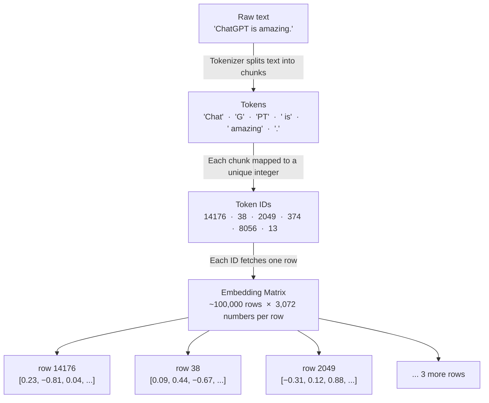

# Tokens: How Words Become Numbers

Every time you type a message to an AI, it doesn't read your words. It reads numbers. And the way those words become numbers is stranger — and more interesting — than you might expect.

This is the first post in a 41-part series where we build a complete mental model of how large language models work, from the ground up. No PhD required. Just curiosity, and optionally a Python prompt.

We start with the most fundamental question: what does an LLM actually *see* when you send it a message?

## Words Aren't What You Think

Let's start with a sentence: `ChatGPT is amazing.`

Your instinct might be to split that into words: `["ChatGPT", "is", "amazing", "."]` — four pieces.

But that's not what GPT-4 sees. Run it through GPT-4's tokenizer and you get: `["Chat", "G", "PT", " is", " amazing", "."]` — six pieces. "ChatGPT" splits into three chunks. " is" keeps its leading space. The full stop stands alone.

These chunks are called **tokens**. They're the atoms of language for a large language model.

Understanding tokens isn't just trivia. It explains why AI sometimes feels "off", why long conversations cost more, and why you can't fit an entire novel into a single prompt. Everything downstream — embeddings, attention, generation — operates on tokens. Get this right and the rest of the series will click into place.

## What Actually Is a Token?

A token is a chunk of text that the model recognises as a single unit. It could be:

- A whole word: `" amazing"` (space included — more on that in a moment)
- Part of a word: `"Chat"`, `"G"`, `"PT"` when the word is rare
- A punctuation mark: `"."`
- A number: `"2024"` as one token, or `"2"`, `"0"`, `"2"`, `"4"` separately depending on the tokenizer

Each token maps to a unique integer — its **token ID**. The vocabulary is fixed at training time. GPT-4 has around 100,000 tokens. Llama 3 has 128,000. Every input you send gets converted to a list of these IDs before the model does a single calculation.

Here's what that looks like in Python. Install `tiktoken` — OpenAI's tokenizer library — and run this:

```python
import tiktoken

# cl100k_base is the encoding used by GPT-4
enc = tiktoken.get_encoding("cl100k_base")

text = "ChatGPT is amazing."

# Text → list of token IDs
token_ids = enc.encode(text)
print("Token IDs:", token_ids)
# → [14176, 38, 2049, 374, 8056, 13]

# Each ID → the text it represents
tokens = [enc.decode([t]) for t in token_ids]
print("Tokens:   ", tokens)
# → ['Chat', 'G', 'PT', ' is', ' amazing', '.']

print(f"{len(text)} characters → {len(token_ids)} tokens")
# → 19 characters → 6 tokens
```

Notice two things. First, spaces are baked *into* tokens — `" is"` starts with a space. This is intentional: it means the model never has to think about whitespace as a separate concept. Second, "ChatGPT" becomes three tokens because it's an unusual compound word that the tokenizer never saw often enough to memorise as a single unit.

## Why Not Just Use Characters? Or Words?

Fair question. Here's why both extremes fail:

**Characters are too fine-grained.** English has ~26 letters plus punctuation — a tiny vocabulary. But every sentence becomes hundreds of units to process. The model has to learn to spell before it can learn to reason. Training is slow and performance suffers.

**Words are too coarse.** Splitting by whitespace means "run", "runs", "running", and "runner" are four completely separate entries, even though they share a root and meaning. Worse, rare words — names, technical jargon, words in other languages — might appear only once in training. The model either never learns them or needs a catch-all `[UNK]` (unknown) token for anything it hasn't seen. You end up with a brittle vocabulary that can't handle the real world.

**Sub-word tokens hit the sweet spot.** Common words get their own dedicated token. Rare words get split into familiar, meaningful pieces. "unbelievable" might tokenize as `["un", "believ", "able"]` — three tokens the model already understands from other contexts. You get a vocabulary of 50,000–130,000 tokens that can represent any text: English, code, Arabic, emoji, all of it.

This approach has a name: **Byte-Pair Encoding** (BPE). We'll build it from scratch in Post 2. For now just know: the vocabulary is learned from data. The most frequent character sequences get promoted to their own tokens, merge by merge, until the vocabulary is full.

## The Token ID Is Just a Row Number

Here's the most useful mental model for everything that follows:

The model has a giant lookup table called an **embedding matrix**. It has one row per token in the vocabulary. When the tokenizer outputs a list of IDs like `[14176, 38, 2049, 374, 8056, 13]`, the model uses each ID to grab a row from that table.

Each row is a vector — a list of a few thousand numbers — that encodes the "meaning" of that token. We'll dig into what those numbers represent in Post 4 (Embeddings). For now, just notice: the token ID is only an index. The number `38` doesn't mean anything special — it's just "fetch row 38 from the embedding matrix." What's *at* that row is where the meaning lives.

You can peek at the vocabulary to build intuition. But first, the full picture of what just happened to your text:



```python
# What text does each token ID represent?
for token_id in [0, 1, 100, 1000, 10000]:
    text = enc.decode([token_id])
    print(f"ID {token_id:6d}  →  {repr(text)}")

# Typical output:
# ID      0  →  '!'
# ID      1  →  '"'
# ID    100  →  'an'
# ID   1000  →  'riend'       ← fragment of "friend"
# ID  10000  →  'chio'        ← fragment of "Pinocchio" etc.
```

Low IDs tend to be common characters and short words — they were added to the vocabulary first during training. High IDs are rarer chunks.

## Why Tokens Matter Day-to-Day

Three things you'll bump into immediately:

**Context windows are measured in tokens, not words.** GPT-4's 128,000-token context window holds roughly 96,000 words of English — close to a full novel. But paste in Python code or Korean and your token count rises fast. Non-Latin scripts are often 2–4× more token-expensive than English for the same information content. Plan accordingly.

**API costs are per token.** You pay separately for input tokens (the prompt) and output tokens (the response). A 1,000-word email is roughly 1,300 input tokens. A 500-word reply is ~650 output tokens. This is why knowing your token count matters when you're building anything at scale.

**Tokenization creates surprising blind spots.** GPT models famously struggle to count letters in words — "how many 'r's are in strawberry?" The reason: `"strawberry"` tokenizes as `["straw", "berry"]`. The model never sees individual letters. It's not a reasoning failure; it's a tokenization artefact. Knowing this helps you work around it.

## Key Takeaways

- An LLM never reads text — it reads a sequence of integers called **token IDs**
- Tokens are sub-word chunks: common words get one token; rare words get split into familiar pieces
- The vocabulary is fixed at training time — typically 50,000–130,000 tokens
- A token ID is just a row index in an embedding matrix — the model looks up the corresponding vector
- Context limits, API costs, and some model quirks all trace back directly to how tokenization works

## What's Next

In Post 2, we build **Byte-Pair Encoding from scratch** in pure Python — the algorithm that creates the vocabulary in the first place. You'll start with raw text, count character pairs, and watch a vocabulary grow, merge by merge, from 256 bytes to thousands of meaningful chunks. It's one of those algorithms that sounds daunting and turns out to be almost embarrassingly simple once you see it.

---
*Part 1 of [AI in Simple English — Learn LLMs by Building](https://medium.com/@your-handle). New posts every Monday and Thursday. Follow the series on [GitHub](https://github.com/your-username/ai-in-simple-english) and [LinkedIn](#).*
