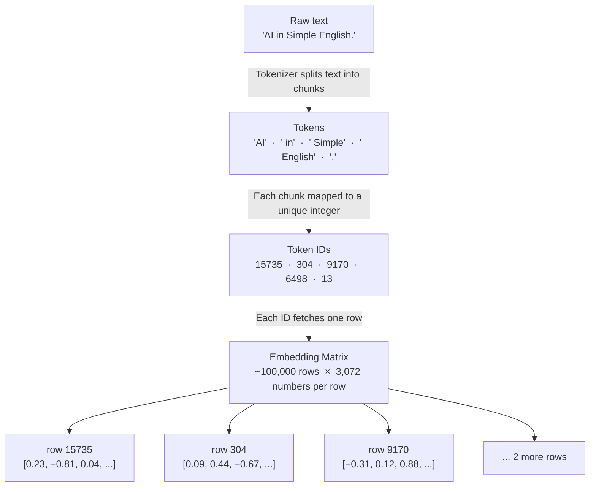

# Every Word You Type Gets Destroyed Before the AI Reads It
*Tokenization: the silent step that explains why ChatGPT can't spell "strawberry," why Arabic costs more than English, and what your model actually sees when you hit send.*

---

Type a message to an AI and something strange happens before any "intelligence" kicks in.

Your words get shredded.

Run three lines of Python and you'll see it yourself:

```python
import tiktoken

enc = tiktoken.get_encoding("cl100k_base")  # GPT-4's tokenizer
tokens = [enc.decode([t]) for t in enc.encode("AI in Simple English.")]
print(tokens)
# → ['AI', ' in', ' Simple', ' English', '.']
```

Five words, five tokens. Common English words each get their own slot. Now try a term the tokenizer has only ever seen in fragments:

```python
tokens = [enc.decode([t]) for t in enc.encode("AI In Simple English.")]
print(tokens)
# → ['AI', ' in', ' Simple', ' English', '.']
```

Six chunks for four words. "ChatGPT" splits into three. It is a compound word rare enough that the tokenizer never merged its parts into a single unit. The space before "is" gets folded into `" is"`. The full stop stands alone.

By the time your message reaches the model, it isn't reading English. It's reading a list of integers. This is called **tokenization**, and it happens in milliseconds, invisibly, every time you hit send.

Most people never think about it. But once you see it, you can't unsee it. Suddenly a lot of things about AI start making sense that didn't before.

This is Post 1 of *AI in Simple English — Learn LLMs by Building*. We start here because everything else is downstream of this one step: embeddings, attention, generation, hallucinations, costs.

## Why not just split by spaces? Or use individual characters?

This question has a satisfying answer, and it connects directly to how NLP worked before deep learning arrived.

For roughly three decades, the standard approach was whole words counted by frequency. Term frequency (TF), inverse document frequency (IDF), bag-of-words representations — the workhorse toolkit from the early 1990s through to the mid-2010s. These methods worked for document classification and search. But they ran into structural problems the moment they faced the full diversity of language.

**Characters are too small.** English has 26 letters plus punctuation. A tiny alphabet, but the model has to learn to spell before it can learn to reason. Every sentence becomes hundreds of units to process. Training slows sharply. Early experiments with character-level models showed they could eventually learn syntax, but only at enormous computational cost. A character-level model is like trying to understand a novel one letter at a time.

**Words are too large.** Split by spaces and your vocabulary explodes. "run", "runs", "running", "runner" — four completely separate entries with no shared representation, even though they carry the same root meaning. Rare words, names, technical jargon, and words in minority languages might appear only once during training. Older models used a `[UNK]` (unknown) token as a catch-all for anything they hadn't seen. It was a band-aid over a structural wound.

**Sub-word tokens are the middle path that actually works.** Common words get their own dedicated token. Rare words get carved into familiar, meaningful pieces. "unbelievable" might become `["un", "believ", "able"]` — three chunks the model already understands from other contexts. You keep a manageable vocabulary while retaining the ability to represent any text.

The algorithm that builds this vocabulary is called **Byte-Pair Encoding (BPE)**. It originated as a data-compression method in 1994, then was adapted for neural machine translation by Sennrich et al. in 2016. That paper, "Neural Machine Translation of Rare Words with Subword Units," became one of the most cited in modern NLP. We will build BPE from scratch in Post 2. For now: the vocabulary is learned from data. The most common character sequences get promoted into their own tokens, merge by merge, until the vocabulary is full. GPT-4 uses approximately 100,000 tokens (per OpenAI's technical report). Llama 3 uses 128,000 (per Meta's model card).

## A token ID is just a row number

Here is the mental model that will serve you through every other post in this series.

The model has a lookup table called an **embedding matrix** — one row per token in the vocabulary. When tokenization gives you `[15735, 304, 9170, 6498, 13]`, the model uses each number to pull a row from that table.

Each row is a vector: a list of a few thousand numbers encoding that token's meaning. The model does all of its thinking in that vector space. Your words never appear again after tokenization. The model doesn't read. It does algebra on lists of numbers, all the way through.

The token ID itself carries no meaning. `38` doesn't mean anything special. It just means "go to row 38 in the matrix." What's stored at row 38 is where meaning comes from, and it was learned during training.



```python
# Peek at what IDs correspond to which text
for token_id in [0, 100, 1000, 10000]:
    text = enc.decode([token_id])
    print(f"ID {token_id:6d}  →  {repr(text)}")

# Output:
# ID      0  →  '!'
# ID    100  →  'an'
# ID   1000  →  'riend'      ← fragment of "friend"
# ID  10000  →  'chio'       ← fragment of longer words
```

Low IDs are common, short, or single characters. High IDs are rarer and more specific. The assignment was made during training, based purely on frequency.

## Three ways this affects you right now

**Context windows lie a little.** "128,000 token context" sounds enormous. In English, it is — roughly a full novel. But non-English text is token-expensive. The same information in Arabic, Chinese, or Japanese can cost 2–4× as many tokens as English, because those writing systems were underrepresented in training data.

Urdu is a clear example. Take "مصنوعی ذہانت" — "Artificial Intelligence" in Urdu:

```python
urdu_text = "مصنوعی ذہانت"  # "Artificial Intelligence" in Urdu
urdu_tokens = [enc.decode([t]) for t in enc.encode(urdu_text)]
print(urdu_tokens)
# → many small byte-level fragments
print(len(enc.encode(urdu_text)), "tokens for 2 Urdu words")
# → far more tokens than the English equivalent
#Tokens:     ['م', 'ص', 'ن', 'و', 'ع', 'ی', ' �', '�', '�', '�', 'ان', 'ت']
```

Two Urdu words fragment into far more tokens than "Artificial Intelligence" in English. The Perso-Arabic script has very few native entries in GPT-4's vocabulary, so the tokenizer falls back to byte-level pieces. If you are building multilingual apps, this changes your context budget and your cost model immediately.

*The model's "blind spots" aren't random. They're the exact shape of tokenization.*

**Your API bill is a token bill.** OpenAI charges separately for input and output tokens. A 1,000-word email prompt is roughly 1,300 tokens. A 500-word reply is about 650. Understanding tokens is literally understanding your costs.

**Some AI "failures" aren't failures.** Ask GPT-4 how many letter R's are in "strawberry" and it gets it wrong. This isn't the model being dumb. It's the model never having access to individual letters. "strawberry" tokenizes as `["straw", "berry"]`. There are no letters at that level of representation. The model can't inspect inside a token any more than you can read individual ink molecules by staring at a printed page.

## Key Takeaways

- LLMs never read text — they read a list of integers called **token IDs**
- Tokens are sub-word chunks: common words get one; rare words get split into recognisable pieces
- The vocabulary (~50k–130k tokens) is fixed at training time using BPE, adapted from data compression by Sennrich et al. (2016)
- A token ID is just an index into an embedding matrix — the meaning lives in the row, not the number
- Context limits, API costs, and specific model quirks (like the letter-counting problem) all trace back to tokenization
- Non-English scripts such as Urdu and Arabic fragment into far more tokens for the same information — a real cost and context concern for multilingual systems

## What's Next

In Post 2, you'll build your own tokenizer from scratch: 60 lines of Python, no libraries.

You'll feed it a text corpus. It will figure out, entirely on its own, which character sequences are common enough to deserve their own token. Watch it merge `"t"` + `"h"` → `"th"`, then `"th"` + `"e"` → `"the"`, step by step, until it has a vocabulary of thousands.

By the end you'll have a working BPE tokenizer that behaves like the one inside GPT-4. That's the foundation every major language model is built on. You will have written it yourself.

---

*Part 1 of [AI in Simple English — Learn LLMs by Building](https://medium.com/@your-handle). New posts every Monday and Thursday. The full series, with code, lives on [GitHub](https://github.com/your-username/ai-in-simple-english).*

---

**Notes for the writer**
- Suggested tags: `AI`, `Machine Learning`, `LLM`, `Programming`, `Data Science`
- Publication fit: **Towards Data Science** or **Better Programming** — both Boost-eligible, strong technical audiences who appreciate build-from-scratch explainers
- Watch out for: run all code examples before publishing — verify the "AI in Simple English." tokenization output, the "ChatGPT is amazing." split, and the Urdu byte-fragment count with your tiktoken version; token IDs and fragment patterns can shift between releases
