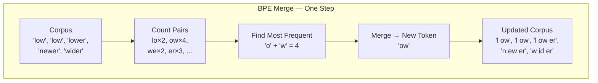
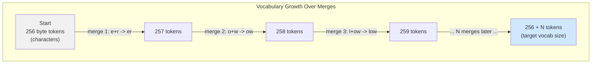

# BPE Tokenisation from Scratch

In Post 1 we saw that LLMs read tokens — not words. But who decides *what* counts as a token?

Think of how abbreviations work in a busy office. People start by writing everything in full. Then the phrases that appear constantly get shortened — "as soon as possible" becomes ASAP, "please review" becomes PR. The language evolves by promoting the most repeated sequences to first-class symbols.

GPT-4's tokenizer does exactly this, applied to characters rather than phrases. The algorithm is called Byte-Pair Encoding (BPE), and you can build a working version in about 50 lines of Python.

By the end of this post you will have done exactly that — and you will have a clear mental model of how GPT-4's 100,000-token vocabulary was constructed.

## The Problem: You Can't List Every Word

Imagine you're designing a language for a computer. You want it to recognise every word a person might write. You could try building a dictionary — one entry per word. But English has hundreds of thousands of words, people invent new ones constantly, and misspellings, names, and code snippets don't appear in any dictionary.

You need a scheme that handles *every possible sequence of characters*, including ones you've never seen.

Here's the core tension: the more vocabulary entries you have, the more memory and computation the model needs. The fewer you have, the more words fall outside the vocabulary and get chopped into awkward fragments.

BPE is the solution that GPT-2, GPT-4, Llama, and most modern LLMs use. It finds the best middle ground automatically, from data.

## The Idea: Start Small, Merge What's Common

BPE applies the same logic to characters instead of words.

**Start with the smallest possible alphabet** — typically all 256 bytes or every single character in your training text. Each character is one token.

**Count every adjacent pair of symbols** in the entire training corpus. Find the pair that appears most often.

**Merge that pair into a new single token** and add it to the vocabulary. Replace every occurrence of that pair in the corpus with the new token.

**Repeat** until the vocabulary reaches the size you want (50,000, 100,000, or whatever you set).

That's the whole algorithm. The vocabulary grows by exactly one token per iteration. The merge order is the thing you save — it is your tokenizer.




## Build It in Python

Here is the full training loop. No libraries needed beyond the standard library.

```python
"""
Minimal BPE: count pairs, find the most frequent, merge.
Run this on a tiny corpus to see the algorithm in action.
"""

from collections import Counter


def get_pairs(vocab: dict[str, int]) -> Counter:
    """Count every adjacent symbol pair across the corpus."""
    pairs = Counter()
    for word, freq in vocab.items():
        symbols = word.split()
        for i in range(len(symbols) - 1):
            pairs[(symbols[i], symbols[i + 1])] += freq
    return pairs


def merge_pair(pair: tuple[str, str], vocab: dict[str, int]) -> dict[str, int]:
    """Merge the chosen pair everywhere it appears in the vocab."""
    merged = " ".join(pair)
    replacement = "".join(pair)
    return {
        word.replace(merged, replacement): freq
        for word, freq in vocab.items()
    }


# Start: every word split into characters, with end-of-word marker </w>
vocab = {
    "l o w </w>": 5,
    "l o w e r </w>": 2,
    "n e w e s t </w>": 6,
    "w i d e s t </w>": 3,
}

NUM_MERGES = 6

for i in range(NUM_MERGES):
    pairs = get_pairs(vocab)
    best_pair = max(pairs, key=pairs.get)
    vocab = merge_pair(best_pair, vocab)
    print(f"Merge {i+1}: {best_pair!r:25s} -> {''.join(best_pair)!r}")
```

Run this and the algorithm discovers `es`, then `est`, then `low` — actual English morphemes — purely from counting, with no linguistic knowledge baked in.

Notice the `</w>` end-of-word marker. Without it, the token `"low"` could ambiguously be the complete word "low" or the prefix in "lower". The marker keeps word boundaries intact.

## Vocabulary Growth: From 256 to 50,000



GPT-2 set N = 50,000, arriving at a 50,257-token vocabulary (50,000 merges plus 256 base bytes plus one special end-of-text token). GPT-4 uses `cl100k_base` with about 100,000 tokens. Llama 3 uses SentencePiece BPE with 128,000.

More tokens means longer words get represented as single tokens — shorter sequences, faster computation. Fewer tokens means better coverage of rare words and multilingual text — more predictable fallback to character-level pieces.

## Encoding: Apply the Merge Table

Training learns the merge rules. Encoding applies them, in order.

```python
def bpe_encode(word: str, merges: list[tuple[str, str]]) -> list[str]:
    """Encode a single word using the learned merge table."""
    symbols = list(word) + ["</w>"]
    for pair in merges:
        i = 0
        while i < len(symbols) - 1:
            if (symbols[i], symbols[i + 1]) == pair:
                symbols[i] = "".join(pair)
                del symbols[i + 1]
            else:
                i += 1
    return symbols
```

Start with characters. Walk through the merge table in the exact order it was learned. Apply each merge where the pair is present. The order matters — applying merges out of order produces different tokens, because earlier merges feed later ones.

Try encoding a word that was not in training, like `"unknown"`. BPE falls back to characters or sub-character byte representations. Nothing breaks. Every string is encodeable. This is the key property that makes BPE robust where a fixed-dictionary approach would produce `[UNK]`.

## The "Start of Word" Gotcha

One practical detail trips people up: the same sequence of characters gets different tokens depending on position.

GPT-2's tokenizer (and most others) attaches a special prefix — often `Ġ` (Unicode 0x120, a space marker) — to the first character of any word that follows a space. So `" low"` (with leading space) is one set of tokens, and `"low"` at the very start of a string is another.

This means `"lower"` can tokenise differently at the start of a sentence versus mid-sentence. It is not a bug — the model uses this to distinguish word boundaries — but it causes confusion when you count tokens manually or split text for a prompt.

## BPE vs. WordPiece vs. SentencePiece

BPE is not the only option. Two other algorithms appear frequently enough to know:

**WordPiece** (BERT, DistilBERT, Electra): Same merge idea, but instead of maximising pair frequency it maximises the *likelihood gain* for the training data. Results look similar in practice. The main practical difference: WordPiece has a true `[UNK]` token for anything it cannot resolve; BPE never does.

**SentencePiece** (T5, Llama 1/2, Mistral, Gemma): Treats the input as a raw Unicode byte stream — no pre-tokenization on whitespace. Critical for languages like Chinese, Japanese, or Arabic that do not use spaces as word separators. SentencePiece can use BPE or a Unigram language model internally.

| Feature | BPE | WordPiece | SentencePiece |
|---|---|---|---|
| Merge criterion | Pair frequency | Likelihood gain | Freq or Unigram LM |
| Whitespace | Pre-split | Pre-split | Handled internally |
| OOV handling | Byte fallback | `[UNK]` token | Byte fallback |
| Used by | GPT-*, Llama 3 | BERT, RoBERTa | T5, Llama 1/2, Mistral |

## What the Vocabulary Reveals

The BPE vocabulary reflects the *training corpus*, not the world.

Common English words become single tokens — `" the"` is one token in GPT-4. Rare words and proper nouns split into pieces — `"Dostoevsky"` is three or four tokens. Python keywords like `def`, `return`, and `import` appear as single tokens in code-trained models because they appeared together millions of times during training.

Non-English languages get fewer tokens per word in English-first models. A French or Arabic sentence that would be 10 tokens in a multilingual model might be 30 tokens in an English-dominant one. This affects context window usage and API cost directly — it is one reason multilingual applications are more expensive than they appear.

Nothing is truly out-of-vocabulary with byte-level BPE. The worst case is a rare Unicode character splitting into several byte tokens. No input causes a failure.

## What You Have Built

Your 50-line BPE trainer does exactly what the GPT-2 paper describes — the same algorithm, just on a smaller corpus. Karpathy's [minbpe](https://github.com/karpathy/minbpe) is a clean, production-quality version of this same idea if you want to take it further.

The merge table you save is your tokenizer. It encodes three things: the starting alphabet, the target vocabulary size, and the merge order — which sub-word units the model will think in.

In Post 3 we look at what sits on top of the token IDs: the vocabulary structure, special tokens like `<|endoftext|>` and `<|im_start|>`, and chat templates — the machinery that turns a flat sequence of token IDs into a conversation the model understands.

---

*This is post 2 of a 41-part series on how LLMs work, built from first principles. Code for this post is in the GitHub repo.*
