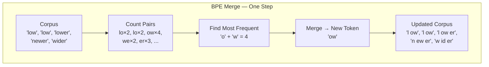
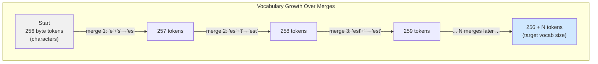

# The 50-Line Algorithm That Decides How GPT-4 Reads Your Words

GPT-4 doesn't read English. It reads numbers. Specifically, it reads a list of integers — each one pointing to a sub-word piece in a vocabulary of about 100,000 entries.

The question is: who decided what those 100,000 pieces are?

An algorithm did. The same algorithm you can write in 50 lines of Python. It's called Byte-Pair Encoding, and once you understand it, a lot of mysterious AI behaviour — why costs spike for some languages, why your prompt fit yesterday but not today, why "ChatGPT" splits into three tokens — stops being mysterious.

## Every Dictionary Has an Edge

If you wanted a computer to understand language, the obvious first move is a dictionary. One entry per word. Look up the word, get a number, pass the number to the model.

This breaks immediately. English has hundreds of thousands of words. People misspell, invent, code-switch, and type usernames that never appeared in any dictionary. A fixed dictionary turns every unlisted item into `[UNK]` — unknown — and the model learns nothing about it.

The opposite extreme — one entry per character — handles everything but makes sequences very long. A 200-word paragraph becomes 1,000+ characters. The model has to track relationships across all of them. Slow, expensive, and it struggles with long-range patterns.

**BPE is the middle path.** Start with characters. Merge the most frequent pairs. Stop when the vocabulary is the size you want. The result: common words are single tokens, rare ones split gracefully into recognisable pieces.

## The Office Abbreviation Algorithm

Think of a busy team that starts by writing everything out in full: "as soon as possible," "please review," "end of day." Over time, the phrases that appear constantly get abbreviations: ASAP, PR, EOD. The language evolves by promoting the most repeated sequences to first-class symbols.

BPE is exactly this, applied to characters.

**Step 1.** Split every word in your training corpus into characters. Add a special end-of-word marker — `</w>` — so the model can tell `"low"` (the complete word) from `"low"` (the prefix in "lower").

**Step 2.** Count every adjacent character pair across the entire corpus.

**Step 3.** Merge the most frequent pair into a new single symbol. Update the corpus. Add the new symbol to the vocabulary.

**Step 4.** Repeat from Step 2 until you hit your target vocabulary size.

The merge order is the thing you save. That ordered list of rules is your tokenizer.



## Build It

Here's the training loop in full. No external libraries.

```python
from collections import Counter


def get_pairs(vocab: dict[str, int]) -> Counter:
    """Count every adjacent symbol pair across the corpus."""
    pairs = Counter()
    for word, freq in vocab.items():
        symbols = word.split()
        for i in range(len(symbols) - 1):
            pairs[(symbols[i], symbols[i + 1])] += freq
    return pairs


def merge_pair(pair: tuple[str, str], vocab: dict[str, int]) -> dict[str, int]:
    """Merge the chosen pair everywhere it appears in the vocab."""
    merged = " ".join(pair)
    replacement = "".join(pair)
    return {
        word.replace(merged, replacement): freq
        for word, freq in vocab.items()
    }


vocab = {
    "l o w </w>": 5,
    "l o w e r </w>": 2,
    "n e w e s t </w>": 6,
    "w i d e s t </w>": 3,
}

for i in range(6):
    pairs = get_pairs(vocab)
    best_pair = max(pairs, key=pairs.get)
    vocab = merge_pair(best_pair, vocab)
    print(f"Merge {i+1}: {best_pair!r:25s} → '{''.join(best_pair)}'")

# Output:
# Merge 1: ('e', 's')              → 'es'
# Merge 2: ('es', 't')             → 'est'
# Merge 3: ('est', '</w>')         → 'est</w>'
# Merge 4: ('l', 'o')             → 'lo'
# Merge 5: ('lo', 'w')             → 'low'
# Merge 6: ('n', 'e')              → 'ne'
```

The algorithm builds `es`, then `est`, before assembling `lo` and then `low` from their parts. Real English morphemes surface from nothing but pair counts. No dictionary. No grammar rules. Just a counter.

**The algorithm has no linguistics degree. It has a counter.**

## Try It Without Writing Code

Before reading further, open one of these in another tab:

- **OpenAI Tokenizer** (platform.openai.com/tokenizer): paste any text and watch GPT-4 split it into colour-coded tokens.
- **Tiktokenizer** (tiktokenizer.vercel.app): same idea, with multiple model vocabularies side by side.

Paste a French sentence. Count the tokens. Then paste the English translation and count again. The cost difference is visible immediately, and it makes the next two sections click faster.

## From 256 to 100,000



GPT-2: 50,257 tokens (50,000 merges + 256 bytes + 1 special). GPT-4: ~100,000. Llama 3: 128,000.

Each additional token means one more sub-word unit the model can process in a single step. Common words become single tokens. Rare ones split into pieces — but known pieces, never a black-box unknown.

## Encoding: Replay the Merges

Training learns the rules. Encoding applies them.

```python
def bpe_encode(word: str, merges: list[tuple[str, str]]) -> list[str]:
    """Encode a single word using the learned merge table."""
    symbols = list(word) + ["</w>"]
    for pair in merges:
        i = 0
        while i < len(symbols) - 1:
            if (symbols[i], symbols[i + 1]) == pair:
                symbols[i] = "".join(pair)
                del symbols[i + 1]
            else:
                i += 1
    return symbols


# Using the 6 merges learned above:
merges = [('e','s'), ('es','t'), ('est','</w>'), ('l','o'), ('lo','w'), ('n','e')]

print(bpe_encode("lower", merges))
# Output: ['low', 'e', 'r', '</w>']

print(bpe_encode("newest", merges))
# Output: ['ne', 'w', 'est</w>']
```

Start with characters. Walk the merge table in learned order. Apply each merge where the pair exists. The order matters: the same two characters merged at step 3 versus step 3,000 produce different tokens, because earlier merges feed into later ones.

**Every string is encodeable.** Byte-level BPE starts at individual bytes (0–255). Even an emoji or a script the model has never seen resolves to a sequence of bytes. No `[UNK]`. No failure mode. Just longer sequences for rarer content.

## Three Things That Will Surprise You

**The space is part of the token.** In GPT-2's tokenizer, `" low"` (with leading space) and `"low"` (without) are different tokens. Most words that follow a space are encoded with the space baked in. This is why counting tokens by splitting on spaces gives you the wrong answer.

**The same word, different tokens, depending on position.** `"lower"` at the start of a sentence can tokenise differently from `"lower"` mid-sentence, because the space-prefix rule applies differently. This is not a bug. The model uses it to track word boundaries. It's consistently surprising nonetheless.

**French costs more than English.** A model trained mostly on English text will have allocated most of its merge budget to English sub-words. French, Arabic, or Mandarin words that would be one or two tokens in a multilingual model might be five or eight tokens in an English-first one. This inflates API costs and burns context window directly. If you're building for multilingual users on an English-first model, factor this in.

## BPE vs. WordPiece vs. SentencePiece

You'll encounter two other tokenization schemes:

**WordPiece** (BERT, DistilBERT): Merges based on likelihood gain rather than raw frequency. Results look similar. The main difference: WordPiece has a true `[UNK]` token for anything it can't resolve; BPE never does.

**SentencePiece** (T5, Llama 1/2, Mistral): Processes raw Unicode without whitespace pre-splitting. Essential for languages without space-separated words. Uses BPE or a Unigram model internally.

Most models built after 2020 use BPE or SentencePiece-BPE. WordPiece survives in the BERT family.

## The Vocabulary Is a Mirror of the Training Data

What ends up in the vocabulary tells you what was common in the training text.

`" the"` is one token. `"Dostoevsky"` is three or four. `"def"`, `"return"`, `"import"` are single tokens in code-trained models, because Python keywords appeared millions of times. `"tokenization"` versus `"tokenisation"`: the American spelling likely gets fewer characters per token in a US-text-heavy corpus.

The vocabulary is not a neutral design choice. It's a compressed record of what the training corpus cared about.

## What You've Built

Your 50-line BPE trainer does exactly what the GPT-2 paper describes. The algorithm hasn't changed; only the scale has. GPT-4's tokenizer ran the same loop for ~100,000 iterations on a corpus measured in terabytes.

In Post 3: the vocabulary structure, special tokens (`<|endoftext|>`, `<|im_start|>`, `<|im_end|>`), and chat templates — the scaffolding that turns a flat sequence of token IDs into a conversation with roles and memory.

---

*Part 2 of [AI in Simple English — Learn LLMs by Building](https://medium.com/@ambreenh16). New posts every Monday and Thursday. The full series, with code, lives on [GitHub](https://github.com/umberH/AI_in_simple_english/tree/main/posts/02-bpe-from-scratch).*

---

**Notes for the writer**
- Suggested tags: `tokenization`, `NLP`, `LLM`, `machine learning`, `Python`
- Publication fit: Towards Data Science or The Sequence — both boost practical ML tutorials with code; this fits both criteria (code-driven, concept-anchored)
- Watch out for: Replace `@your-handle` and the GitHub URL path with your actual Medium handle and the correct repo branch/tag once Post 2 is tagged — verify the link resolves before publishing

---

## 🌍 Environmental Footprint of This Post

*This post was drafted and revised with the help of a large language model (Claude). Here is an estimate of the environmental cost of generating it — because if we're going to talk about AI, we should be honest about what it costs.*

| | Estimate | Equivalent to |
|---|---|---|
| 💧 Water (cooling) | ~12.0 L | ≈ 48 cups of water |
| 🌫️ Carbon | ~60.0 g CO₂e | ≈ driving 0.50 km in an average car |
| ⚡ Energy | ~60.0 Wh | ≈ an LED bulb for 6 hours |

**How these are calculated:** ~12,000 tokens total across 2 revision round(s). Water estimate based on Microsoft's 2023 disclosure of ~500 ml per 50 API calls for data centre cooling ([Li et al., 2023](https://arxiv.org/abs/2304.03271)). Carbon based on ~0.005 kg CO₂e per 1k tokens on the US grid average ([Patterson et al., 2021](https://arxiv.org/abs/2104.10350)). All figures are order-of-magnitude estimates — exact values depend on data centre location, energy mix, and model size.

*Figures generated on 2026-07-10 by [env_stats.py](https://github.com/umberH/ai-in-simple-english/blob/main/scripts/env_stats.py)*
